# Лабораторная работа №2. Kubernetes

## Цель работы

Поднять кластер Kubernetes локально, в нём развернуть свой сервис.

## Ход работы

Для выполнения работы был использован локальный кластер Minikube, который позволяет поднять локальный кластер Kubernetes. После установки Minikube, был запущен кластер с помощью команды `minikube start`:

    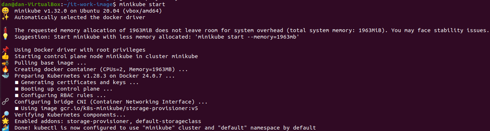

Создание "витруального" хранилища образов для докера на порту 5000:

    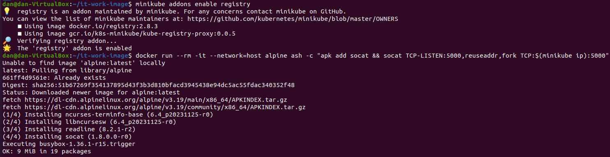

В качестве разворачиваемого сервиса было создано приложение выводящее в браузере: "Hello Docker world!". Для этого было создано 3 файла: Dockerfile, app.py и requirements.

Dockerfile:

    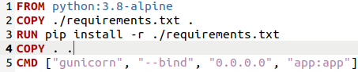

app.py:

    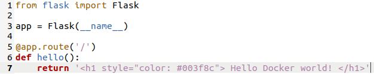

requirements:

    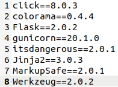

После создания всез необходимых файлов был собран докер-образ

    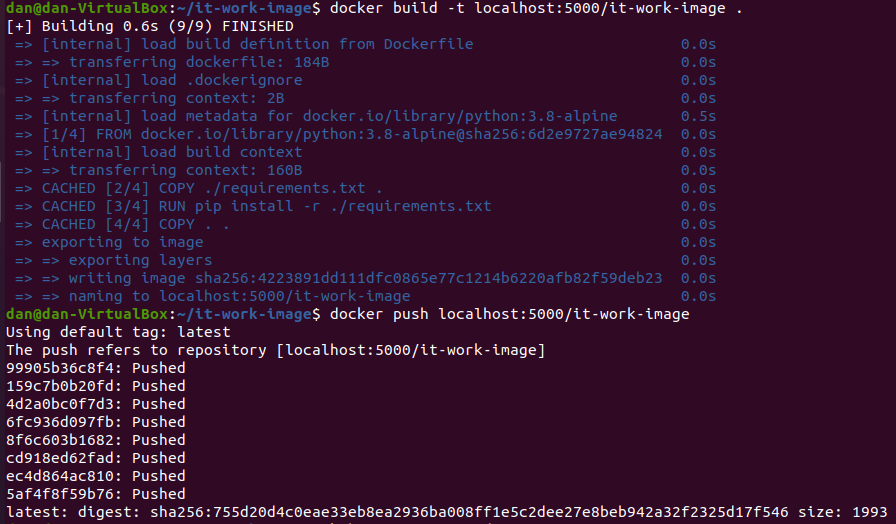

Чтобы с помощью kubernetes можно было развернуть созданное приложение необходимо прописать манифесты (Deployment и Service) в формате yalm-файлов.

Deployment.yalm:

    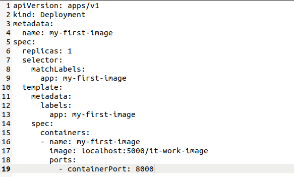

Описание Deployment'а:

- `replicas: 1` - количество реплик нашего приложения
- `selector` - селектор, по которому Kubernetes будет искать поды, которые нужно масштабировать
- `template` - шаблон пода, который будет создан при масштабировании
- `containers` - список контейнеров, которые будут запущены в поде
- `name` - имя контейнера
- `image` - образ, который будет запущен в контейнере. В данном случае, это образ нашего приложения. Ранее он был загружен в Docker Hub.
- `ports` - список портов, которые будут открыты в контейнере

Service.yalm

    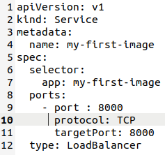

Описание Service'а:

- `type:` - тип сервиса.
- `selector` - селектор, по которому Kubernetes будет искать поды, которые нужно балансировать
- `ports` - список портов, которые будут открыты в сервисе
- `nodePort` - порт, который будет открыт на каждой ноде кластера
- `targetPort` - порт, на который будет перенаправлен трафик
- `port` - порт, который будет открыт в сервисе
- `protocol` - протокол, по которому будет работать сервис

После yalm-файлы были применены:

    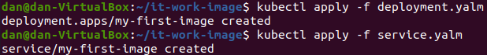

Сервис был запущен с помощью команды `minikube service my-first-image`

    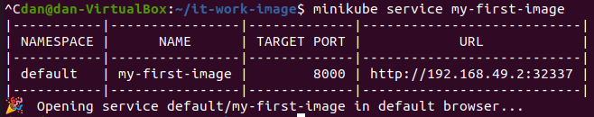

Результат:

    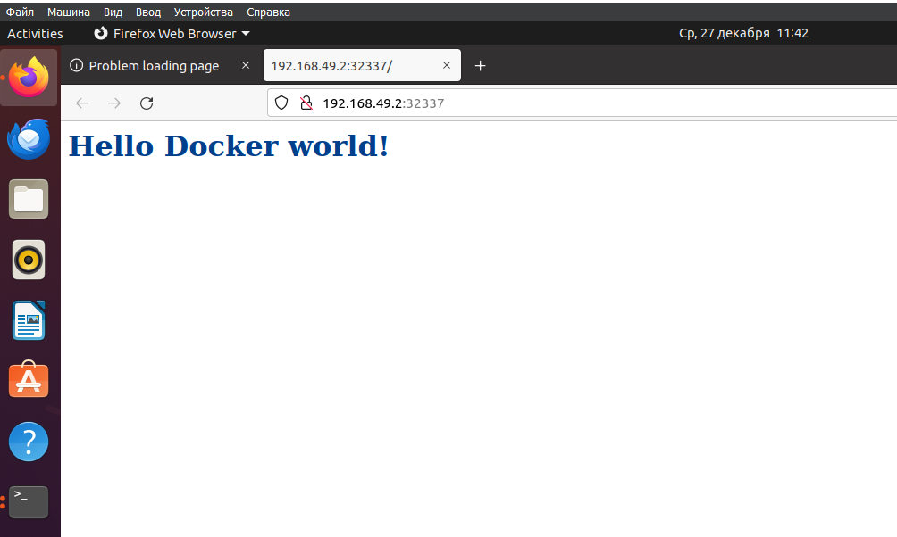

## Вывод

В результате выполнения лабораторной работы был поднят кластер Kubernetes локально, в нём был развернут свой сервис.
